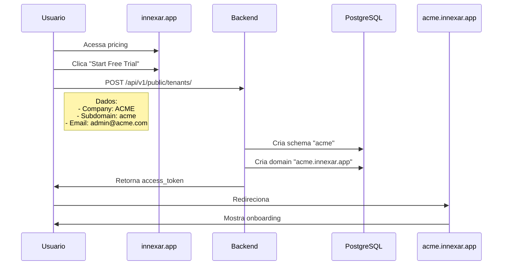

# ✅ Arquitetura de Domínio Atualizada - innexar.app

## 🎯 RESUMO DA MUDANÇA

**ANTES (Múltiplos domínios):**
```
❌ innexar.com       → USA
❌ innexar.com.br    → Brasil
❌ innexar.mx        → México
```

**AGORA (Domínio único com subdomínios):**
```
✅ innexar.app                    → Site institucional (landing, pricing, blog)
✅ admin.innexar.app              → Painel super admin
✅ {tenant}.innexar.app           → Cada cliente (ex: acme.innexar.app)
✅ api.innexar.app                → Backend API
```

---

## 📂 ARQUIVOS ATUALIZADOS

### 1. ✅ Backend Django

**`c:\innexar_erp\config\settings.py`**
```python
# Wildcards para subdomínios
ALLOWED_HOSTS = [
    'localhost',
    '127.0.0.1',
    '.localhost',           # *.localhost (dev)
    'innexar.app',          # Domínio principal
    '.innexar.app',         # *.innexar.app (todos subdomínios)
]

# CORS
CORS_ALLOWED_ORIGINS = [
    'http://localhost:3000',
    'https://innexar.app',
    'https://admin.innexar.app',
    'https://api.innexar.app',
]

# CORS: Allow all tenant subdomains
CORS_ALLOWED_ORIGIN_REGEXES = [
    r'^https://.*\.innexar\.app$',  # *.innexar.app
]

CORS_ALLOW_CREDENTIALS = True

# URLs por contexto
PUBLIC_SCHEMA_URLCONF = 'config.urls_public'  # innexar.app (landing page)
# TODO: Create 'config.urls_admin' for admin.innexar.app
```

### 2. ✅ Frontend - Especificação da API

**`c:\innexar_erp\frontend\BACKEND_API_SPEC.md`**
```markdown
### URLs de Produção

Backend:  https://api.innexar.app

Frontend:
  Site Institucional:  https://innexar.app
  Painel Admin:        https://admin.innexar.app
  Cliente (tenant):    https://{tenant}.innexar.app
  Exemplo:             https://acme.innexar.app
```

### 3. ✅ Documentação de Arquitetura

**`c:\innexar_erp\docs\ARQUITETURA_DOMINIOS.md`** (NOVO)
- 500+ linhas de documentação completa
- Configuração DNS (Cloudflare)
- Middleware Next.js para detecção de contexto
- Exemplos de fluxos (registro, login, admin)
- Nginx config (se self-hosted)
- SSL wildcard
- CSP (Content Security Policy)
- Checklist de implementação

---

## 🔍 COMO FUNCIONA?

### 1️⃣ Landing Page (innexar.app)

```typescript
// URL: https://innexar.app
// Contexto: public
// Schema PostgreSQL: public
// URLConf: config.urls_public

Usuário acessa → Landing page
              → Pricing
              → Blog
              → Registro de novo tenant
```

### 2️⃣ Admin Panel (admin.innexar.app)

```typescript
// URL: https://admin.innexar.app
// Contexto: admin
// Schema PostgreSQL: public
// URLConf: config.urls_admin (TO BE CREATED)

Super Admin → Ver todos tenants
           → Analytics global
           → Billing consolidado
           → Support tickets
           → Impersonate (acessar como cliente)
```

### 3️⃣ Tenant Apps ({tenant}.innexar.app)

```typescript
// URL: https://acme.innexar.app
// Contexto: tenant
// Schema PostgreSQL: acme
// URLConf: config.urls

Cliente → Dashboard
       → CRM
       → Financeiro
       → Faturamento
       → Estoque
       → Projetos
       → etc...
```

---

## 🚀 FLUXO DE REGISTRO



---

## 🌍 MULTILÍNGUE

### Landing Page (innexar.app)

```typescript
// Auto-detecta idioma do navegador
https://innexar.app/en/pricing       → Inglês (USA)
https://innexar.app/pt-BR/pricing    → Português (Brasil)
https://innexar.app/es/pricing       → Espanhol (LATAM)
```

### Admin Panel (admin.innexar.app)

```typescript
// Sempre em inglês (padrão)
// Super admin pode alterar manualmente
```

### Tenant Apps ({tenant}.innexar.app)

```typescript
// Idioma salvo nas preferências do tenant
const tenant = await Tenant.findOne({ schema_name: 'acme' })
tenant.default_locale  // 'pt-BR', 'en', 'es'
```

---

## 🔐 AUTENTICAÇÃO

### 1. Landing Page (innexar.app)

```bash
# Sem autenticação
# Apenas registro de novos tenants
```

### 2. Admin Panel (admin.innexar.app)

```bash
POST https://api.innexar.app/api/v1/admin/auth/login/
{
  "email": "admin@innexar.app",
  "password": "xxx"
}
```

### 3. Tenant Apps ({tenant}.innexar.app)

```bash
POST https://api.innexar.app/api/v1/auth/login/
Headers:
  X-Tenant-Slug: acme

{
  "email": "john@acme.com",
  "password": "xxx"
}
```

---

## 🛠️ PRÓXIMOS PASSOS

### Backend Django

- [ ] **Criar `config/urls_admin.py`**
  - Endpoints para super admin
  - Listar/editar todos tenants
  - Analytics global
  - Billing consolidado

- [ ] **Middleware para detecção de contexto**
  - Se `admin.innexar.app` → usar urls_admin
  - Se `innexar.app` → usar urls_public
  - Se `{tenant}.innexar.app` → usar urls (django-tenants)

- [ ] **Modelo SuperAdmin**
  - Criar model `apps.admins.SuperAdmin`
  - Permissões especiais
  - Não pertence a nenhum tenant (schema public)

### Frontend Next.js

- [ ] **Criar contexto detection utility**
  - `lib/utils/context.ts`
  - Função `getAppContext()` → 'public' | 'admin' | 'tenant'

- [ ] **Middleware Next.js**
  - Detectar domínio
  - Rotear para layouts corretos
  - Validar se tenant existe

- [ ] **3 layouts separados**
  - `app/(public)/layout.tsx` → Landing page
  - `app/(admin)/layout.tsx` → Admin panel
  - `app/(tenant)/layout.tsx` → Tenant apps

### DevOps

- [ ] **DNS (Cloudflare)**
  ```
  Type    Name     Value           Proxy
  A       @        54.123.45.67    ✅
  A       *        54.123.45.67    ✅
  CNAME   admin    innexar.app     ✅
  CNAME   api      innexar.app     ✅
  ```

- [ ] **SSL Wildcard**
  ```bash
  certbot certonly --dns-cloudflare \
    -d innexar.app \
    -d *.innexar.app
  ```

- [ ] **Vercel Config**
  ```json
  {
    "domains": ["innexar.app", "*.innexar.app"],
    "wildcard": true
  }
  ```

---

## 📊 COMPARAÇÃO COM PADRÃO DE MERCADO

### SaaS Multi-tenant Conhecidos

```
✅ Slack:       acme.slack.com
✅ Notion:      acme.notion.so
✅ Basecamp:    acme.basecamphq.com
✅ Zendesk:     acme.zendesk.com
✅ Shopify:     acme.myshopify.com

✅ Innexar:     acme.innexar.app  👈 NOSSA ARQUITETURA
```

**Vantagens:**
- ✅ Isolamento total entre tenants (PostgreSQL schemas)
- ✅ SEO otimizado (cada subdomínio = site único)
- ✅ Fácil de escalar (adicionar tenant = criar schema)
- ✅ URL clean e profissional
- ✅ Wildcard SSL simples
- ✅ Custo baixo (1 domínio vs 3+)

---

## 🎉 CONCLUSÃO

### Arquitetura COMPLETA e DOCUMENTADA! ✅

**Documentos criados:**
1. ✅ `docs/ARQUITETURA_DOMINIOS.md` (500+ linhas)
2. ✅ `docs/STATUS_DOMINIO.md` (este arquivo)

**Código atualizado:**
1. ✅ `config/settings.py` (ALLOWED_HOSTS + CORS)
2. ✅ `frontend/BACKEND_API_SPEC.md` (BASE URLs)

**Pronto para:**
- Frontend team implementar (já tem docs completos)
- Backend continuar desenvolvimento (arquitetura clara)
- DevOps configurar DNS e SSL
- 30-day sprint começar! 🚀

**Arquitetura:**
```
innexar.app ÚNICO ✅
├── innexar.app           (landing)
├── admin.innexar.app     (super admin)
└── *.innexar.app         (tenants)
```

**Simples, escalável, profissional!** 🎯
